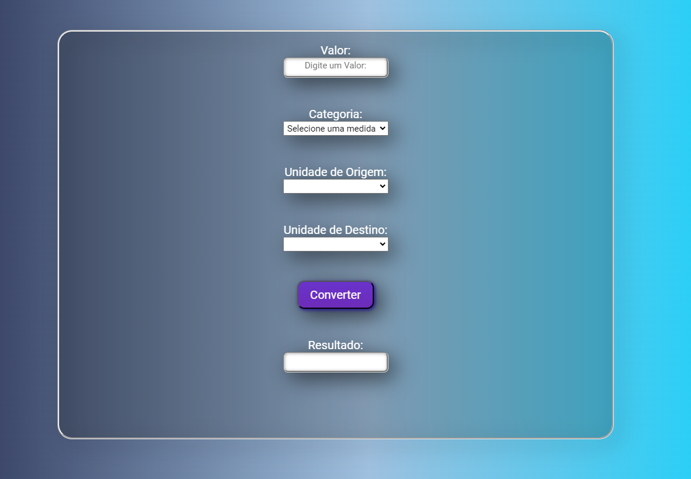

# Conversor de Unidades

Este é um projeto de um conversor de unidades, para o múdulo 02 da Resilia Educação, implementado em HTML, CSS e JavaScript. Ele permite que os usuários convertam valores entre diferentes categorias, como comprimento, peso e temperatura.

  

## Funcionalidades

- Seletor de categoria: Os usuários podem selecionar a categoria de conversão desejada, como comprimento, peso ou temperatura.
- Seletor de unidades: Com base na categoria selecionada, os usuários podem escolher as unidades de origem e destino para a conversão.
- Campo de valor: Os usuários podem inserir o valor que desejam converter.
- Botão de conversão: Ao clicar no botão de conversão, o sistema realiza a conversão e exibe o resultado na área de resultado.
- Tecla Enter: Os usuários também podem pressionar a tecla Enter em qualquer lugar selecionado da tela para acionar a conversão.

## Como usar

1. Faça o download ou clone este repositório em seu computador.
2. Abra o arquivo `index.html` em seu navegador web.
3. Selecione a categoria de conversão desejada no seletor de categoria.
4. Escolha as unidades de origem e destino nos seletores correspondentes.
5. Insira o valor que deseja converter no campo de valor.
6. Clique no botão "Converter" ou pressione a tecla Enter para realizar a conversão.
7. O resultado da conversão será exibido na área de resultado.

## Exemplos de Uso

### Conversão de Comprimento

- Selecione a categoria "Comprimento".
- Escolha "Metro (m)" como a unidade de origem e "Centímetros (cm)" como a unidade de destino.
- Insira o valor em metros que deseja converter.
- Clique no botão "Converter" ou pressione a tecla Enter.
- O resultado da conversão será exibido na área de resultado.

### Conversão de Peso

- Selecione a categoria "Peso".
- Escolha "Quilogramas (kg)" como a unidade de origem e "Libras (lb)" como a unidade de destino.
- Insira o valor em quilogramas que deseja converter.
- Clique no botão "Converter" ou pressione a tecla Enter.
- O resultado da conversão será exibido na área de resultado.

### Conversão de Temperatura

- Selecione a categoria "Temperatura".
- Escolha "Celsius (°C)" como a unidade de origem e "Fahrenheit (°F)" como a unidade de destino.
- Insira o valor em graus Celsius que deseja converter.
- Clique no botão "Converter" ou pressione a tecla Enter.
- O resultado da conversão será exibido na área de resultado.

## Contribuição

Se você encontrar algum problema ou tiver sugestões de melhorias, sinta-se à vontade para abrir uma issue neste repositório. Estamos abertos a contribuições para tornar este conversor de unidades ainda melhor.
